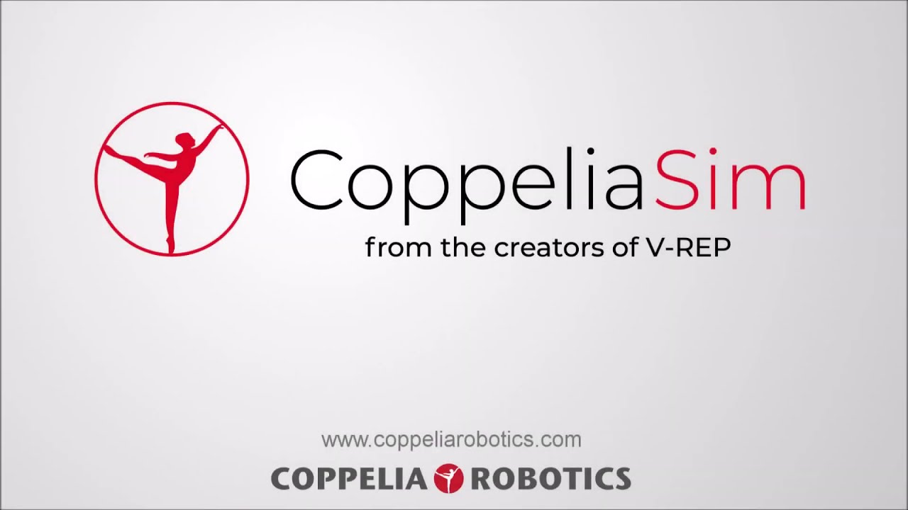
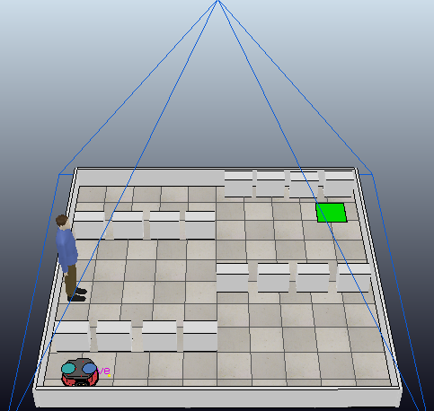
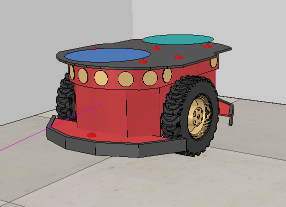
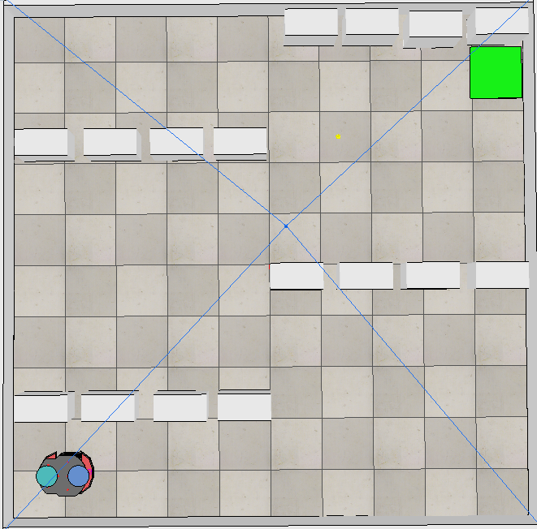

# Vrep Warehouse Simulation

## :zap: Sobre
Esta é uma simulação muito simplificada de um robô em uma warehouse com propósitos de fazer um estudo de alguns requisitos de tempo real. A aplicação está configurada para rodar 30 vezes seguidas, mas pode ser alterado para quantas vezes for necessário. Para saber mais veja o [artigo](https://github.com/gabriel1997castro/coppelia_warehouse_simulation/blob/main/PTR_Lab_02_Relat_rio.pdf).

## :rocket: Ambiente e instalação

1) O simulador usado foi CoppeliaSim, antigo VREP, para instalar basta ver as instruções no site da Coppelia e seguir os passos para rodar o código com api remota em python. Caso precise, copie os arquivos da api python para o mesmo diretório substituindo os existentes.

2) Instalar o Anaconda completo que já contém todas as bibliotecas necessárias para rodar o projeto ou instalar os requisitos que são: 
* jupyter-notebook
* openCV
* matplotlib
* numpy

3) Rodar o CoppeliaSim

4) Abrir jupyter

5) Rodar o arquivo main.ipynb

## :gear: Ambiente

* Versão do python: 3.8.5
* Versão do Copperlia: Edu 4.2.0

  

## :camera: Imagens do Projeto

  
  
  

